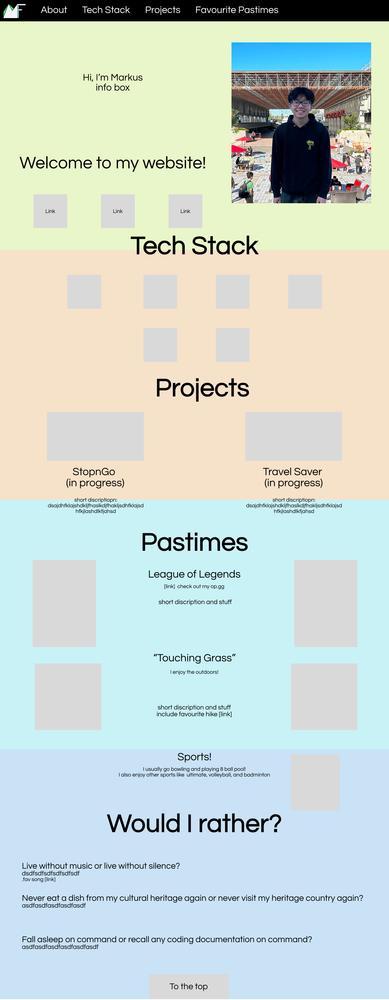

# mkusf.github.io
# cmpt 276 mini project
## Ackowledgements
I took inspiration from these website for my website https://benscott.dev/#about, https://internet.game/blog/the-ultimate-list-of-100-either-or-questions-for-adults
Resources I used:
https://www.youtube.com/watch?v=phWxA89Dy94, https://www.youtube.com/watch?v=_GTMOmRrqkU&t=1022s, https://www.youtube.com/watch?v=wsTv9y931o8, https://www.w3schools.com/
## Wire frame

## Wireframe documentation

